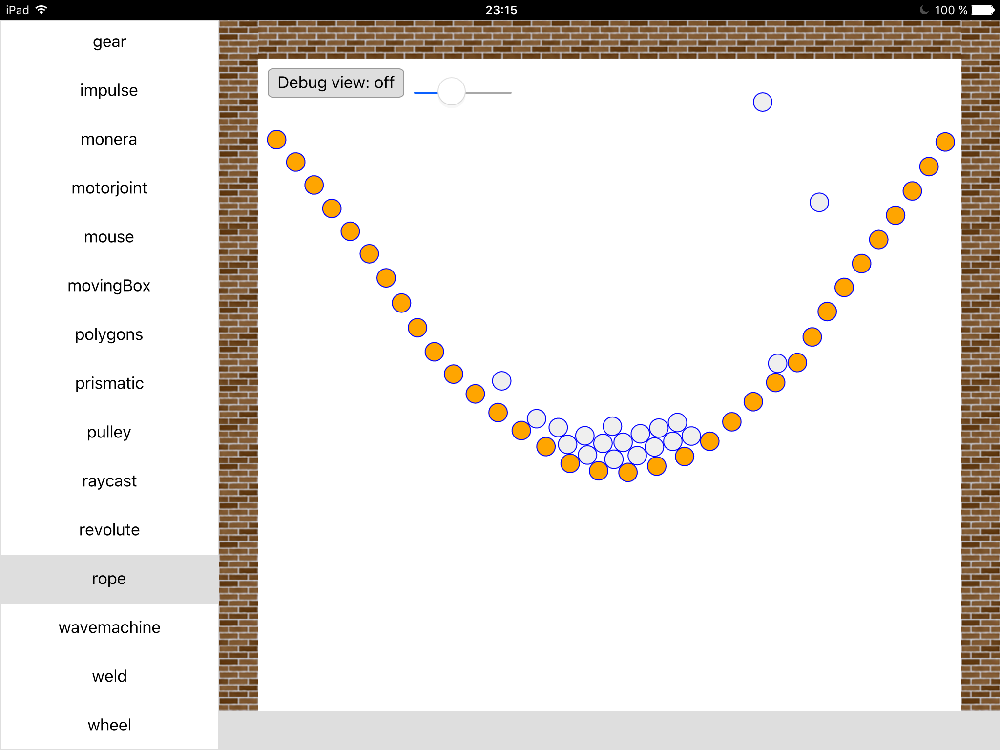

## QML Box2D plugin

The goal of the qml-box2d plugin is to expose the functionality of Box2D (C++)
as a QML plugin in order to make it easier to write physics based software in
QML.

This plugin is meant to be installed to your Qt/imports directory, or shipped
in a directory of which the parent is added as import path.

### Installing

    qmake
    make
    make install  (goes to Qt's import path, run with sudo if necessary)

The `make install` step will copy the qml-box2d Box2D plugin into your Qt
installation. For example, if you have a Qt installation of:

    /Users/user/Qt/5.12.12

the plugin will be in:

    /Users/user/Qt/5.12.12/clang_64/qml/Box2D.2.0

This example is a Mac path, on other platforms you will see different paths and
compilers.

### Installing on Debian

    debuild -uc -us -b
    sudo dpkg -i ../qml-box2d_*.deb

### Running the Examples

You can run the examples launcher from a Terminal/Cmd prompt with:

    qmlscene examples/ui.qml

(You need to be in the root folder of qml-box2d.)

### Deployment

The standard plugin (dynamically linked) runs well on Mac, Window and Linux.
The qml-box2d plugin can be linked statically to run on both iOS and Android.

### Using Qt Creator

For running you can use a "Custom Executable" configuration set to run
"qmlscene" with the right parameters.

When you have write permissions to Qt's import path, it can be convenient to
add a deployment step to your run settings:

 * Go to Projects -> box2d -> Run Settings
 * Choose Add Deploy Step -> Make
 * Enter "install" under "Make arguments"

This will make sure that before running, the version of the plugin is updated
in Qt's import path.

### Example Screenshots

(These screenshots have been done on an iPad Air)

