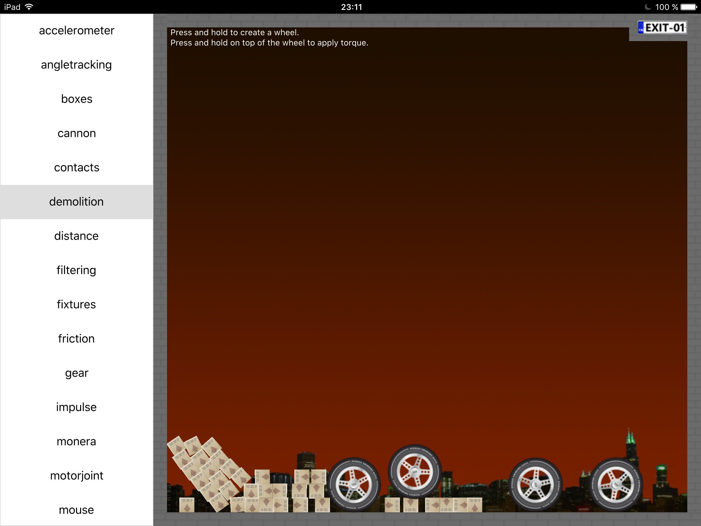
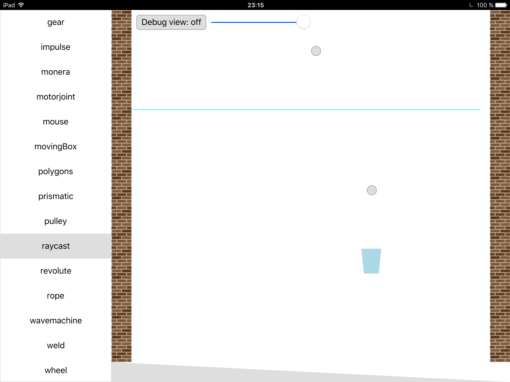

### Example screenshots

The following screenshots have been done on an iPad Air.

In order to be able to run the examples, the qml-box2d plugin needs to be installed.
See INSTALLING on the main page

